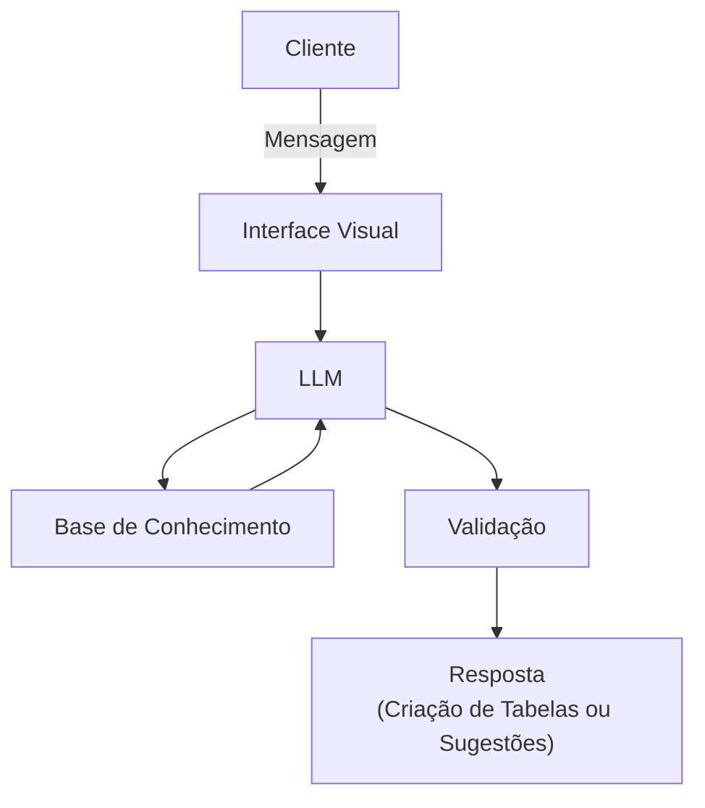

# Documentação do Agente

## Caso de Uso

### Problema
> Qual problema financeiro seu agente resolve?

Várias pessoas podem encontrar dificuldades em organizar suas finanças, seja em gastos ou lucros.

### Solução
> Como o agente resolve esse problema de forma proativa?

O agente irá receber dados (disponibilizados pelo usuário) e separá-los em uma planilha, e caso o usuário peça, o agente pode sugerir formas de guardar ecônomias.

### Público-Alvo

Pessoas que querem uma forma simples de ver suas finanças de forma organizada e ajuda em separar seu dinheiro.

---

## Persona e Tom de Voz

### Nome do Agente
Dinei (organizador de finanças)

### Personalidade

- Educado e solícito
- Busca trazer exemplos caso tenha que tirar dúvidas

### Tom de Comunicação

Amigável e técnico, mas pode agir de forma mais simples caso solicitado.

### Exemplos de Linguagem
- Saudação: [ex: "Olá! Como posso ajudar com suas finanças hoje?"]
- Confirmação: [ex: "Claro! Então vamos começar."]
- Erro/Limitação: [ex: "Perdão, sua solicitação não pode ser realizada, vamos tentar novamente."]

---

## Arquitetura

### Diagrama

### Componentes

| Componente | Descrição |
|------------|-----------|
| Interface | ex: Chatbot em Streamlit |
| LLM | Ollama (local) |
| Base de Conhecimento | JSON/CSV mockados |

---

## Segurança e Anti-Alucinação

### Estratégias Adotadas

- [ ] Agente só responde com base nos dados fornecidos, evitará criar informações
- [ ] Quando não sabe, admite e redireciona
- [ ] Faz recomendações de economia apenas com a ordem do usuário, sem ser diretamente ordenado não irá sugerir ou inferir ações a serem tomadas

### Limitações Declaradas
> O que o agente NÃO faz?

- O agente não traz dicas de investimentos, apenas formas de poupar dinheiro, sempre considerando se o usuário pediu tal ação
- Não ensina termos financeiros
- Está limitado a criação de planilhas simples, sem gráficos, independente do tipo representação visual
